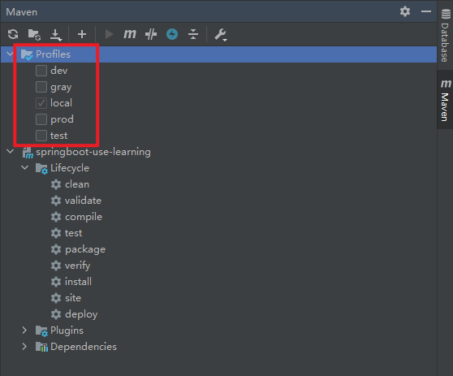
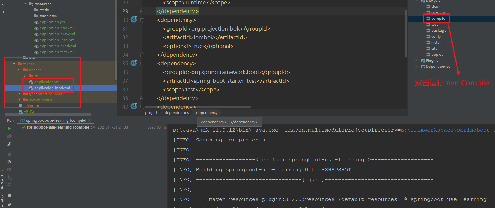
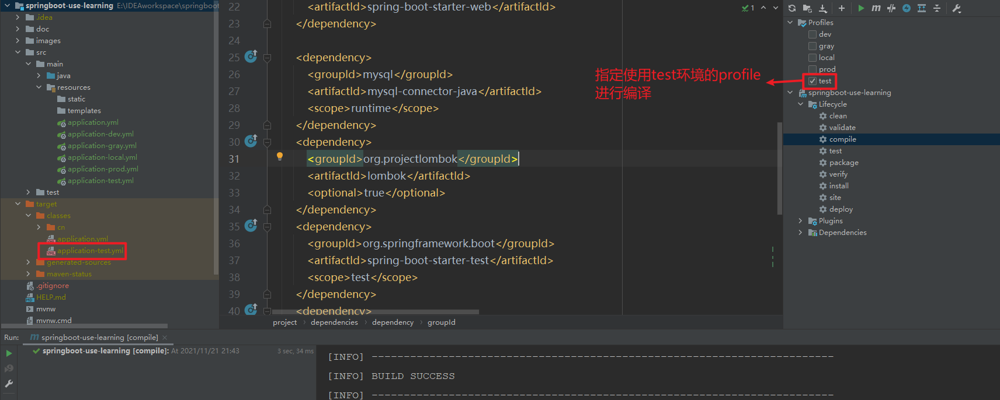

# 一 创建不同环境的配置文件

## 1.1 application.yml

​		在resources文件夹中创建application.yml文件,其中关于不同环境的配置如下:

```yaml
spring:
  profiles:
    active: @profileActive@
```

## 1.2 application-activeProfile.yml

​		配置多个环境下用的配置文件, 例如

```yaml
# application-local.yml: 本地开发使用
server:
  port: 10121
  
# application-dev.yml: 公共开发环境使用
server:
  port: 10122
  
# application-test.yml: 测试环境使用
server:
  port: 10123

# application-gray.yml: 灰度环境使用
server:
  port: 10124

# application-prod.yml: 生产环境使用
server:
  port: 10125
```

# 二 修改pom.xml文件

​		修改工程的pom.xml文件,增加**profiles**标签, 以及增加build标签中的resources标签的内容,代码如下:

```xml
<profiles>
    <!--	个人本地开发环境		-->
    <profile>
        <id>local</id>
        <properties>
            <profileActive>local</profileActive>
        </properties>
        <!--	默认激活的环境		-->
        <activation>
            <activeByDefault>true</activeByDefault>
        </activation>
    </profile>
    <!--	公共开发环境		-->
    <profile>
        <id>dev</id>
        <properties>
            <profileActive>dev</profileActive>
        </properties>
    </profile>
    <!--	测试环境		-->
    <profile>
        <id>test</id>
        <properties>
        	<profileActive>test</profileActive>
        </properties>
    </profile>
    <!--	灰度环境		-->
    <profile>
        <id>gray</id>
        <properties>
        	<profileActive>gray</profileActive>
        </properties>
    </profile>
    <!--	生产环境		-->
    <profile>
        <id>prod</id>
        <properties>
        	<profileActive>prod</profileActive>
        </properties>
    </profile>
</profiles>

<build>
    <resources>
        <resource>
            <directory>src/main/resources</directory>
            <includes>
                <include>application-${profileActive}.yml</include>
                <include>application.yml</include>
                <include>**/*.xml</include>
            </includes>
            <filtering>true</filtering>
        </resource>
        <resource>
            <directory>src/main/java</directory>
            <includes>
            	<include>**/*.xml</include>
            </includes>
        </resource>
    </resources>
</build>
```

# 三 测试效果

## 3.1 Profile选择



## 3.2 根据默认以及指定profile进行编译

​		从图中可以看出本工程的Profile有5种,local有颜色较浅的被选中的标记,表明local是默认的maven编译构建的profile选项.直接使用mvn compile命令,其产生的class文件夹中配置文件就是application-local.yml.效果如下:



​		当勾选上指定profile进行compile之后, classes目录中的配置文件就会是指定profile对应的配置文件,例如指定test,效果如图所示:


