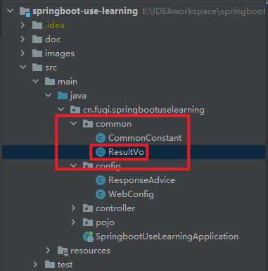
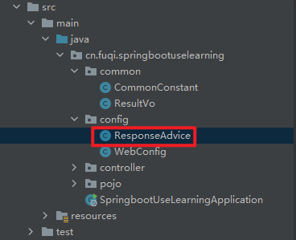
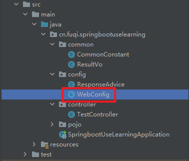

# 1 定义一个统一返回格式的对象



​		内容如下:

```java
@Getter
@Setter
public class ResultVo<T> {
    private int code;

    private String message;

    private T data;

    public ResultVo() {
    }

    public ResultVo(int code, String message) {
        this.code = code;
        this.message = message;
        this.data = null;
    }

    public ResultVo(T data) {
        this.code = CommonConstant.SUCCESS_CODE;
        this.message = null;
        this.data = data;
    }
}
```

# 2 自定义一个ResponseAdvice配置类



​		代码内容如下:

```java
@RestControllerAdvice
public class ResponseAdvice implements ResponseBodyAdvice {

    @Override
    public boolean supports(MethodParameter returnType, Class converterType) {
        return true;
    }

    @Override
    public Object beforeBodyWrite(Object body, MethodParameter returnType, MediaType selectedContentType, Class selectedConverterType, ServerHttpRequest request, ServerHttpResponse response) {
        if (body instanceof ResultVo<?>) {
            return body;
        }

        return new ResultVo<>(body);
    }
}
```

# 3 处理返回的数据类型为String的接口

​		一个返回数据类型为String的接口定义如下:

```java
@GetMapping("/result/auto/package1")
public String autoPackageResultTest1() {
	return "自动封装返回结果测试";
}
```

## 3.1 方法一

​		在上一步的自定义ResponseAdvice类的beforeBodyWrite()方法中增加相关逻辑:

```java
public Object beforeBodyWrite(Object body, MethodParameter returnType, MediaType selectedContentType, Class selectedConverterType, ServerHttpRequest request, ServerHttpResponse response) {
    if (body instanceof ResultVo<?>) {
        return body;
    }

    if (body instanceof String) {
        // 使用fastjson, 需要在pom中引入相关依赖
        return JSON.toJSONString(new ResultVo<>(body));
    }

    return new ResultVo<>(body);
}
```

​		接口请求的返回数据为: 

```json
{
    "code":200,
    "data":"自动封装返回结果测试"
}
```

​		统一返回格式的message字段由于其值为null, 在JSON序列化的过程中被处理了.

## 3.2 方法二

​		增加相关配置, 将MappingJackson2HttpMessageConverter在程序启动时设置到converters中的第一顺位.



​		WebConfig代码如下:

```java
@Configuration
public class WebConfig implements WebMvcConfigurer {
    /**
     * 统一返回数据格式封装处理String类型的数据-方法二
     * @param converters
     */
    @Override
    public void configureMessageConverters(List<HttpMessageConverter<?>> converters) {
        converters.add(0, new MappingJackson2HttpMessageConverter());
        converters.add(new StringHttpMessageConverter());
    }
}
```

​		请求对应接口的返回数据如下:

```json
{
  "code": 200,
  "message": null,
  "data": "自动封装返回结果测试"
}
```

​		完整显示了统一格式的所有字段.